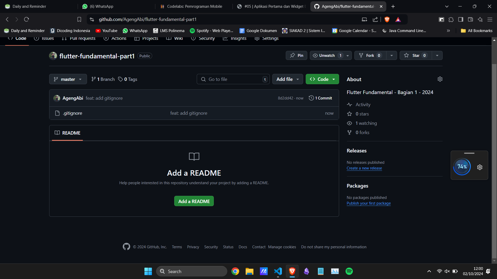

# flutter_fundamental_part1

A new Flutter project.

# Biodata
<table>
    <tr>
        <th>Nama</th>
        <td>Stefanus Ageng Budi Utomo</td>
    </tr>
    <tr>
        <th>Kelas</th>
        <td>TI 3G</td>
    </tr>
    <tr>
        <th>NIM</th>
        <td>2241720126</td>
    </tr>
</table>

# Laporan Praktikum Fundamental Part 1
## Praktikum 1: Membuat Project Flutter Baru
### Langkah 1


### Langkah 2

### Langkah 3


## Praktikum 2: Menghubungkan Perangkat Android atau Emulator


## Pratikum 3: Membuat Repository GitHub dan Laporan Praktikum
### Langkah 1

### Langkah 2

### Langkah 3

### Langkah 4

### Langkah 5

### Langkah 6

### Langkah 7

### Langkah 8

### Langkah 9

### Langkah 10

### Langkah 11


## Praktikum 4: Menerapkan Widget Dasar
### Langkah 1: Text Widget
Buat folder baru basic_widgets di dalam folder lib. Kemudian buat file baru di dalam basic_widgets dengan nama `text_widget.dart`. Ketik atau salin kode program berikut ke project hello_world Anda pada `file text_widget.dart`
``` dart
import 'package:flutter/material.dart';

class MyTextWidget extends StatelessWidget {
  const MyTextWidget({Key? key}) : super(key: key);

  @override
  Widget build(BuildContext context) {
    return const Text(
      "Nama saya Fulan, sedang belajar Pemrograman Mobile",
      style: TextStyle(color: Colors.red, fontSize: 14),
      textAlign: TextAlign.center);
  }
}
```


### Langkah 2: Image Widget
Buat sebuah file `image_widget.dart` di dalam folder basic_widgets dengan isi kode berikut.
``` dart
import 'package:flutter/material.dart';

class MyImageWidget extends StatelessWidget {
  const MyImageWidget({Key? key}) : super(key: key);

  @override
  Widget build(BuildContext context) {
    return const Image(
      image: AssetImage("logo_polinema.jpg")
    );
  }
}
```

Lakukan penyesuaian asset pada file `pubspec.yaml` dan tambahkan file logo Anda di folder assets project hello_world.
``` dart
flutter:
  assets:
     - logo_polinema.jpg
```


## Praktikum 5: Menerapkan Widget Material Design dan iOS Cupertino
### Langkah 1: Cupertino Button dan Loading Bar
``` dart
import 'package:flutter/cupertino.dart';
import 'package:flutter/material.dart';

class MyLoadingCupertino extends StatelessWidget {
  const MyLoadingCupertino({super.key});

  @override
  Widget build(BuildContext context) {
    return MaterialApp(
      home: Container(
        margin: const EdgeInsets.only(top: 30),
        color: Colors.white,
        child: Column(
          children: [
            CupertinoButton(
                child: const Text("Contoh Button"), onPressed: () {})
          ],
        ),
      ),
    );
  }
}
```
### Langkah 2: Floating Action Button (FAB)
``` dart
import 'package:flutter/material.dart';

class MyFabWidget extends StatelessWidget {
  const MyFabWidget({super.key});

  @override
  Widget build(BuildContext context) {
    return MaterialApp(
      home: Scaffold(
        floatingActionButton: FloatingActionButton(
          onPressed: () {
            // Add your onPressed code here!
          },
          backgroundColor: Colors.pink,
          child: const Icon(Icons.thumb_up),
        ),
      ),
    );
  }
}
```
### Langkah 3: Scaffold Widget
``` dart
import 'package:flutter/material.dart';

class MyScaffoldWidget extends StatelessWidget {
  const MyScaffoldWidget({super.key});

  // This widget is the root of your application.
  @override
  Widget build(BuildContext context) {
    return MaterialApp(
      title: 'Flutter Demo',
      theme: ThemeData(
        primarySwatch: Colors.red,
      ),
      home: const MyHomePage(title: 'My Increment App'),
    );
  }
}

class MyHomePage extends StatefulWidget {
  const MyHomePage({super.key, required this.title});

  final String title;

  @override
  State<MyHomePage> createState() => _MyHomePageState();
}

class _MyHomePageState extends State<MyHomePage> {
  int _counter = 0;

  void _incrementCounter() {
    setState(() {
      _counter++;
    });
  }

  @override
  Widget build(BuildContext context) {
    return Scaffold(
      appBar: AppBar(
        title: Text(widget.title),
      ),
      body: Center(
        child: Column(
          mainAxisAlignment: MainAxisAlignment.center,
          children: <Widget>[
            const Text(
              'You have pushed the button this many times:',
            ),
            Text(
              '$_counter',
              style: Theme.of(context).textTheme.headlineMedium,
            ),
          ],
        ),
      ),
      bottomNavigationBar: BottomAppBar(
        child: Container(
          height: 50.0,
        ),
      ),
      floatingActionButton: FloatingActionButton(
        onPressed: _incrementCounter,
        tooltip: 'Increment Counter',
        child: const Icon(Icons.add),
      ),
      floatingActionButtonLocation: FloatingActionButtonLocation.centerDocked,
    );
  }
}
```
### Langkah 4: Dialog Widget
``` dart
import 'package:flutter/material.dart';

class MyDialogWidget extends StatelessWidget {
  const MyDialogWidget({super.key});

  @override
  Widget build(BuildContext context) {
    return const MaterialApp(
      home: Scaffold(
        body: MyLayout(),
      ),
    );
  }
}

class MyLayout extends StatelessWidget {
  const MyLayout({super.key});

  @override
  Widget build(BuildContext context) {
    return Padding(
      padding: const EdgeInsets.all(8.0),
      child: ElevatedButton(
        child: const Text('Show alert'),
        onPressed: () {
          showAlertDialog(context);
        },
      ),
    );
  }
}

showAlertDialog(BuildContext context) {
  // set up the button
  Widget okButton = TextButton(
    child: const Text("OK"),
    onPressed: () {
      Navigator.pop(context);
    },
  );

  // set up the AlertDialog
  AlertDialog alert = AlertDialog(
    title: const Text("My title"),
    content: const Text("This is my message."),
    actions: [
      okButton,
    ],
  );

  // show the dialog
  showDialog(
    context: context,
    builder: (BuildContext context) {
      return alert;
    },
  );
}

```
### Langkah 5: Input dan Selection Widget
``` dart
import 'package:flutter/material.dart';

class MyInputSelectionWidget extends StatelessWidget {
  const MyInputSelectionWidget({super.key});

  @override
  Widget build(BuildContext context) {
    return MaterialApp(
      home: Scaffold(
        appBar: AppBar(title: const Text("Contoh TextField")),
        body: const TextField(
          obscureText: false,
          decoration: InputDecoration(
            border: OutlineInputBorder(),
            labelText: 'Nama',
          ),
        ),
      ),
    );
  }
}

```
### Langkah 6: Date and Time Pickers
``` dart
import 'package:flutter/material.dart';

class MyDateTimePickers extends StatelessWidget {
  const MyDateTimePickers({super.key});

  @override
  Widget build(BuildContext context) {
    return const MaterialApp(
      title: 'Contoh Date Picker',
      home: MyHomePage(title: 'Contoh Date Picker'),
    );
  }
}

class MyHomePage extends StatefulWidget {
  const MyHomePage({super.key, required this.title});

  final String title;

  @override
  _MyHomePageState createState() => _MyHomePageState();
}

class _MyHomePageState extends State<MyHomePage> {
  // Variable/State untuk mengambil tanggal
  DateTime selectedDate = DateTime.now();

  //  Initial SelectDate FLutter
  Future<void> _selectDate(BuildContext context) async {
    // Initial DateTime FIinal Picked
    final DateTime? picked = await showDatePicker(
        context: context,
        initialDate: selectedDate,
        firstDate: DateTime(2015, 8),
        lastDate: DateTime(2101));
    if (picked != null && picked != selectedDate) {
      setState(() {
        selectedDate = picked;
      });
    }
  }

  @override
  Widget build(BuildContext context) {
    return Scaffold(
      appBar: AppBar(
        title: Text(widget.title),
      ),
      body: Center(
        child: Column(
          mainAxisSize: MainAxisSize.min,
          children: <Widget>[
            Text("${selectedDate.toLocal()}".split(' ')[0]),
            const SizedBox(
              height: 20.0,
            ),
            ElevatedButton(
              onPressed: () => {
                _selectDate(context),
                // ignore: avoid_print
                print(selectedDate.day + selectedDate.month + selectedDate.year)
              },
              child: const Text('Pilih Tanggal'),
            ),
          ],
        ),
      ),
    );
  }
}

```

## Tugas Praktikum
1. Selesaikan Praktikum 1 sampai 5, lalu dokumentasikan dan push ke repository Anda berupa screenshot setiap hasil pekerjaan beserta penjelasannya di file README.md!
- Selesai
2. Selesaikan Praktikum 2 dan Anda wajib menjalankan aplikasi hello_world pada perangkat fisik (device Android/iOS) agar Anda mempunyai pengalaman untuk menghubungkan ke perangkat fisik. Capture hasil aplikasi di perangkat, lalu buatlah laporan praktikum pada file README.md.


3. Pada praktikum 5 mulai dari Langkah 3 sampai 6, buatlah file widget tersendiri di folder basic_widgets, kemudian pada file main.dart cukup melakukan import widget sesuai masing-masing langkah tersebut!


4. Selesaikan Codelabs: Your first Flutter app, lalu buatlah laporan praktikumnya dan push ke repository GitHub Anda!
- [Namer_app Repository Link](https://github.com/AgengAbi/namer_app.git)

5. README.md berisi: capture hasil akhir tiap praktikum (side-by-side, bisa juga berupa file GIF agar terlihat proses perubahan ketika ada aksi dari pengguna) dengan menampilkan NIM dan Nama Anda sebagai ciri pekerjaan Anda.

6. Kumpulkan berupa link repository/commit GitHub Anda kepada dosen yang telah disepakati!
